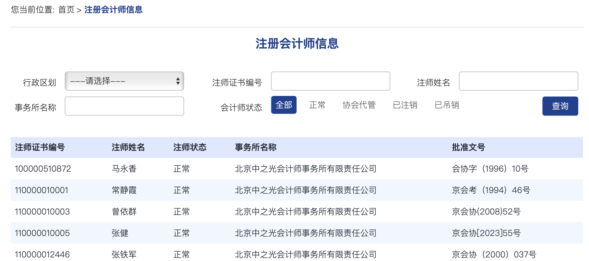
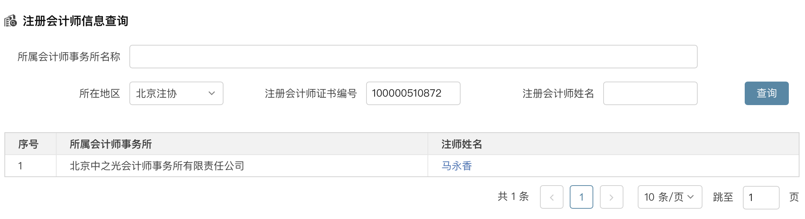

### 2023年7月14日更新

增加了验证码识别。

我这是偷懒，一次获取1000000条信息的，所以可能会出问题，或者等待的时间比较长，如果出问题了，请自行修改下每一次的pageSize。

### 更新

[中国注册会计师行业信息管理系统](https://cmispub.cicpa.org.cn/)竟然大改版了，索性直接删除了以前的爬虫。

反而感觉清爽了不少。数据保存在本地的mongodb\cicpa\cpa，要修改保存方式的话，修改pipeline即可。

### 数据来源

信息来自[中国注册会计师行业信息管理系统](https://cmispub.cicpa.org.cn/)和[财政会计行业管理系统](http://acc.mof.gov.cn)

### 逻辑

1. 从[财政会计行业管理系统](http://acc.mof.gov.cn)查询注册会计师列表

   

2. 记录注册会计师的注师证书编号和地区，在[中国注册会计师行业信息管理系统](https://cmispub.cicpa.org.cn/)发起检索

   

   ```json
   {
       "result": 1,
       "msg": "success",
       "info": {
           "headInfo": {
               "id": "0000010f-849c-6e98-8abc-aecb9e70286e",
               "recver": null,
               "perCode": "100000510872",
               "loginPass": null,
               "perstateCode": null,
               "ascId": null,
               "offId": "0000010f-8496-8857-403f-a440bedd405c",
               "offGuid": null,
               "proId": null,
               "proIdName": null,
               "quatypeCode": "01",
               "certNum": "04070097",
               "certTime": "",
               "testWord": "无",
               "regPlace": "110000",
               "regTime": "1996-01-10",
               "regGov": null,
               "regWord": "会协字（1996）10号",
               "perName": "马永香",
               "perPy": null,
               "gender": "2",
               "brithDate": "1963-03-24",
               "nationCode": "01",
               "nativePlace": null,
               "polityCode": "03",
               "idCard": "110108196303246040",
               "retireCode": "01",
               "addr": "北京市宣武区广安门内大街319号广信嘉园319号C座9C室",
               "phone": null,
               "phoneDecode": null,
               "mobile": null,
               "mobileDecode": null,
               "post": null,
               "email": "zzgkjss@public3.bta.net.cn",
               "profeName": "高级会计师",
               "progradeCode": "02",
               "stuexpCode": "05",
               "degreeCode": null,
               "major": "工程管理",
               "college": "华东石油学院",
               "englishDegree": null,
               "hukouPlace": null,
               "workPlace": null,
               "filesPlace": "北京市人才交流中心",
               "unittypeCode": null,
               "enterTime": "2000-12-22",
               "beforeUnit": "中洲会计师事务所",
               "photoId": null,
               "offDuty": "无",
               "cardType": null,
               "isInchg": null,
               "areaCode": "01",
               "isSafety": null,
               "safetyUnit": null,
               "offName": "北京中之光会计师事务所有限责任公司",
               "partner": null,
               "parMoney": null,
               "partnerOffId": null,
               "genderName": null,
               "quatypeCodeName": null,
               "perstateCodeName": null,
               "remark": null,
               "reservr1": null,
               "reservr2": null,
               "reservr3": null,
               "strAge": null,
               "currentPage": null,
               "pageSize": null,
               "areaName": null,
               "certNumOrtestWord": null,
               "isOffNormal": null,
               "quatypeDesc": null,
               "agreeGov": null,
               "agreeTime": "1996-01-10",
               "isPartner": "0",
               "offAllCode": null,
               "startDate": null,
               "endDate": null,
               "idcardNull": null,
               "nameNull": null,
               "birthNull": null,
               "quatypeNull": null,
               "stuexpNull": null,
               "certnumNull": null,
               "regwordNull": null,
               "certOrTest": null,
               "isStock": "0",
               "startRegTime": null,
               "endRegTime": null,
               "displayItems": null,
               "offCode": null,
               "flag": "-1",
               "npaGuid": "",
               "newPhotoName": "",
               "npaPhotoName": "",
               "perPhotoName": "",
               "srcPhotoPath": "",
               "targetFileDir": "",
               "isNquery": 1,
               "perGuids": null,
               "remarks": null,
               "parGuid": null,
               "regWords": null,
               "reasons": null,
               "times": null,
               "isReNew": null,
               "isFzyReNew": null,
               "isZfAllow": null,
               "impRes": null,
               "impRow": 0,
               "timeLimitCode": "1",
               "perstateValue": null,
               "quatypeValue": null,
               "genderValue": null,
               "nationValue": null,
               "polityValue": null,
               "retireValue": null,
               "progradeValue": null,
               "stuexpValue": null,
               "degreeValue": null,
               "unittypeValue": null,
               "agreeTimeValue": null,
               "proName": "海淀区",
               "isExport": 0,
               "ljcsAnnual": "领军人才年份",
               "cpaetAnnual": "英语测试年份",
               "khbg": "客户及报告情况",
               "ywcxs": "40",
               "rzzg": "最后一次通过任职资格检查时间",
               "wcxs": "0",
               "cjcf": "0",
               "gyhd": "0",
               "policyValue": "否",
               "tableName": null,
               "officeTableName": null,
               "searchYear": null,
               "searchMonth": null,
               "parition": null,
               "startAge": null,
               "endAge": null,
               "zynxType": null,
               "zynx": null,
               "regDate1": null,
               "regDate2": null,
               "offType": null,
               "orgmode": null,
               "startBirthDate": null,
               "endBirthDate": null,
               "proGuid": null,
               "twoascGuid": null,
               "idCardDecode": null
           }
       }
   }
   ```

其实如果不想要这么详细的数据的话，在[财政会计行业管理系统](http://acc.mof.gov.cn)的请求里把pageSize设置成999999就可以一次把所有数据导出了，实际上我在start_requests里也是这么偷懒的，就是可能会牺牲一点性能吧。